# DNS Data Exfiltration Detection

**Static and streaming binary classification for DNS-based attack detection.**

This project implements **DNS data exfiltration detection** with two components:
- **Static model** — Batch binary classification (Benign vs Attack) on DNS features using Random Forest and Gradient Boosting.
- **Dynamic model** — Online learning over Kafka streams with window-based evaluation and conditional retraining when performance drops.

---

## Project Overview

| Component | Description |
|-----------|-------------|
| **Static model** | Train Random Forest and Gradient Boosting on batch DNS data; evaluate with F1, ROC-AUC, PR-AUC, and confusion matrices. |
| **Dynamic model** | Consume DNS records from Kafka in windows; compare a fixed static model vs a model that retrains when F1 drops (e.g. > 2%). |
| **Data pipeline** | Producer notebook pushes CSV data into Kafka; consumer or dynamic notebook reads from the topic. |
| **Infrastructure** | Docker Compose for Zookeeper and Apache Kafka. |

---

## Results Achieved

### Static Model (batch evaluation)

Metrics target an imbalanced binary task (Benign vs Attack):

- **Primary:** F1-Score (macro)
- **Secondary:** ROC-AUC, PR-AUC (Average Precision)
- **Display:** Confusion matrices, ROC curves, Precision–Recall curves

**Summary table**

| Model | F1 (macro) | ROC-AUC | PR-AUC | Accuracy (test) |
|-------|------------|---------|--------|------------------|
| **Random Forest** | **0.863** | 0.805 | 0.758 | 0.83 |
| **Gradient Boosting** | **0.862** | 0.802 | 0.753 | 0.82 |

- **Best CV F1-Score (grid search):** 0.8632  
- **Train/test split:** 80% / 20% (~53K test samples)  
- Raw accuracy is not used as the sole metric (a naive all-attack predictor would still show ~55% accuracy).

**Classification report (test set)**

*Random Forest*

|              | precision | recall | f1-score | support |
|--------------|-----------|--------|----------|---------|
| Benign       | 1.00      | 0.61   | 0.76     | 24,179  |
| Attack       | 0.76      | 1.00   | 0.86     | 29,436  |
| **accuracy** |           |        | **0.83** | 53,615  |
| macro avg    | 0.88      | 0.81   | 0.81     | 53,615  |
| weighted avg | 0.87      | 0.83   | 0.82     | 53,615  |

*Gradient Boosting*

|              | precision | recall | f1-score | support |
|--------------|-----------|--------|----------|---------|
| Benign       | 1.00      | 0.61   | 0.76     | 24,179  |
| Attack       | 0.76      | 1.00   | 0.86     | 29,436  |
| **accuracy** |           |        | **0.82** | 53,615  |
| macro avg    | 0.88      | 0.81   | 0.81     | 53,615  |
| weighted avg | 0.87      | 0.82   | 0.82     | 53,615  |

### Dynamic Model (streaming)

- **Window size:** 1,000 observations per window  
- **Retrain rule:** Trigger when F1 drops more than 2% below baseline  
- **Outcome:** Static and dynamic models stay in sync when distribution is stable; dynamic model can be retrained when drift is detected.  
- Per-window F1 typically in the **0.84–0.87** range across runs (see notebook outputs).

---

## Generated Figures & Diagrams

Figures are produced by the notebooks and saved in `setup_docs/`. Key visuals are shown below.

### Static model (Part I)

| Figure | File | Description |
|--------|------|-------------|
| 1 | `fig_01_class_distribution.png` | Class distribution (Benign vs Attack) |
| 2 | `fig_02_feature_distributions.png` | Feature histograms |
| 3 | `fig_03_boxplots_by_class.png` | Feature boxplots by class |
| 4 | `fig_04_correlation_heatmap.png` | Feature correlation heatmap |
| 5 | `fig_05_mutual_information.png` | Mutual information with target |
| 6 | `fig_06_anova_ftest.png` | ANOVA F-test feature scores |
| 7 | `fig_07_rf_importance.png` | Random Forest feature importance |
| 8 | `fig_08_confusion_matrices.png` | Confusion matrices (RF and GB) |
| 9 | `fig_09_roc_curves.png` | ROC curves and AUC |
| 10 | `fig_10_pr_curves.png` | Precision–Recall curves |
| 11 | `fig_11_model_comparison.png` | F1 / ROC-AUC / PR-AUC bar comparison |

**Class distribution (Benign vs Attack)**

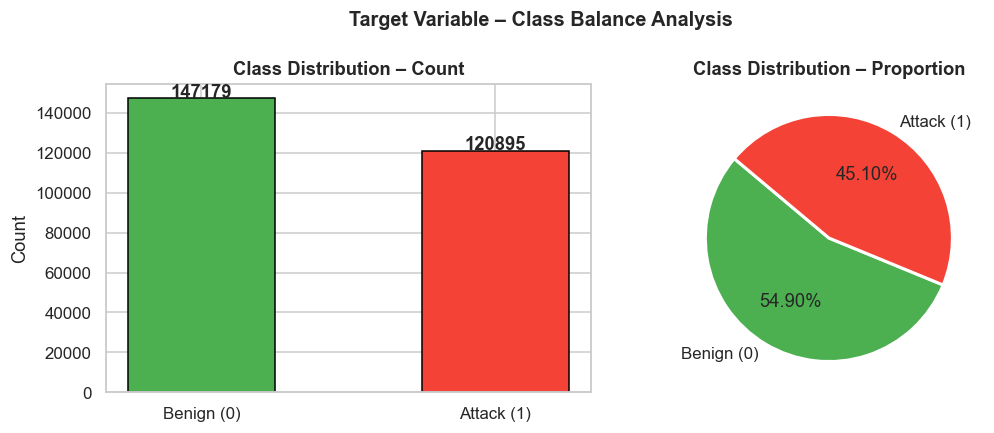

**Feature distributions**

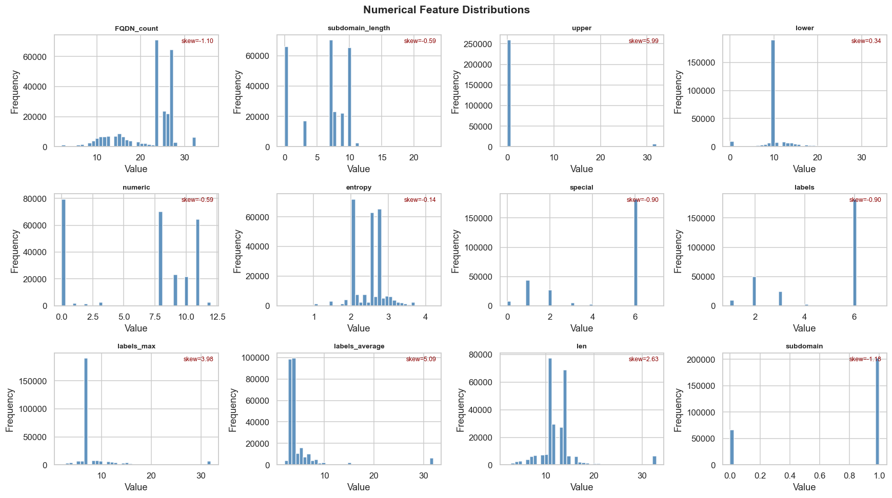

**Feature boxplots by class**

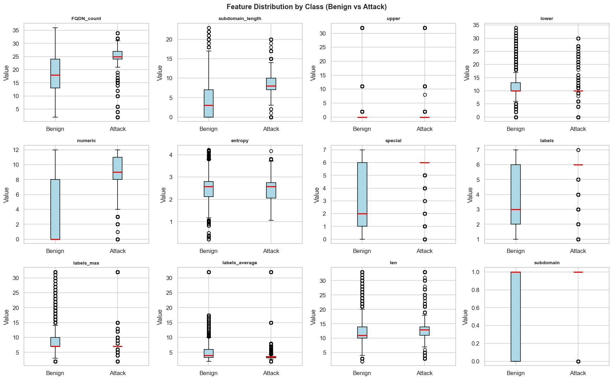

**Feature correlation heatmap**

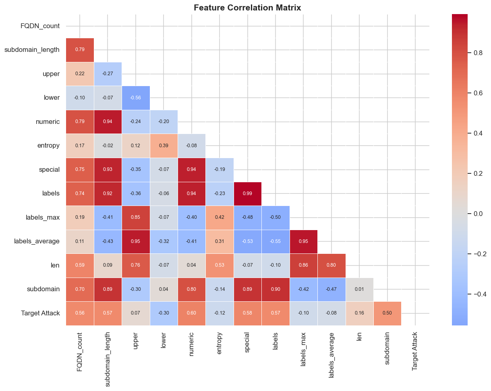

**Mutual information with target**

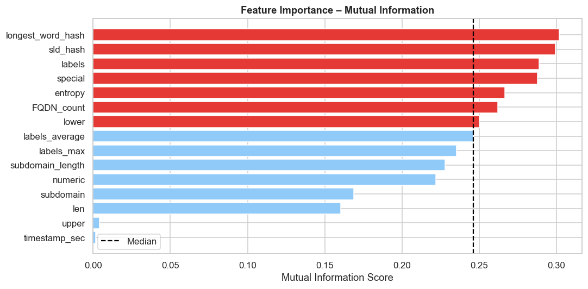

**ANOVA F-test feature scores**

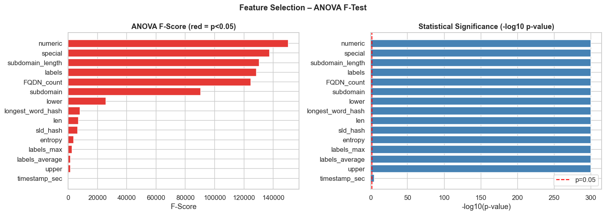

**Random Forest feature importance**

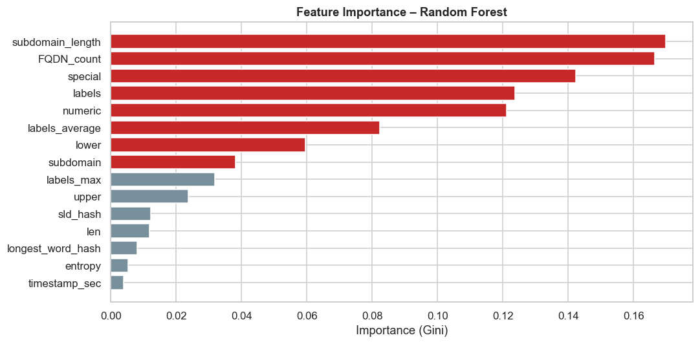

**Confusion matrices (Random Forest & Gradient Boosting)**

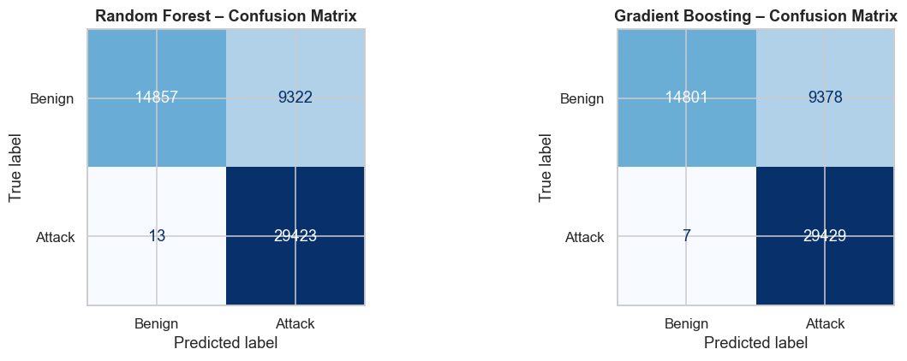

**ROC curves and AUC**

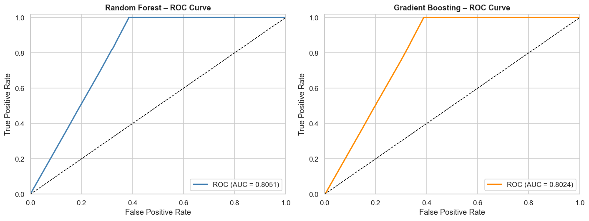

**Precision–Recall curves**

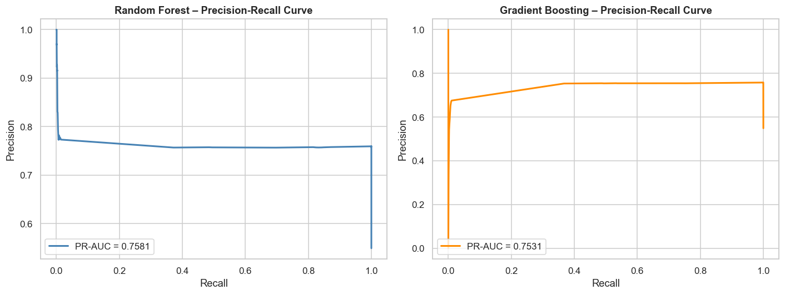

**Model comparison (F1, ROC-AUC, PR-AUC)**

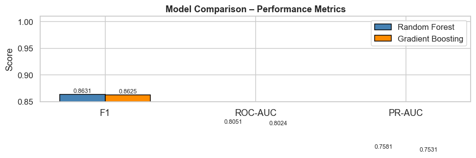

### Dynamic model (Part II)

| Figure | File | Description |
|--------|------|-------------|
| 12 | `fig_12_time_performance.png` | F1 over time/windows (static vs dynamic) |
| 13 | `fig_13_performance_gap.png` | Performance gap between static and dynamic |
| 14 | `fig_14_retrain_decisions.png` | When retraining was triggered |
| 15 | `fig_15_final_confusion.png` | Final confusion matrix (streaming evaluation) |

**F1 over time / windows (static vs dynamic)**

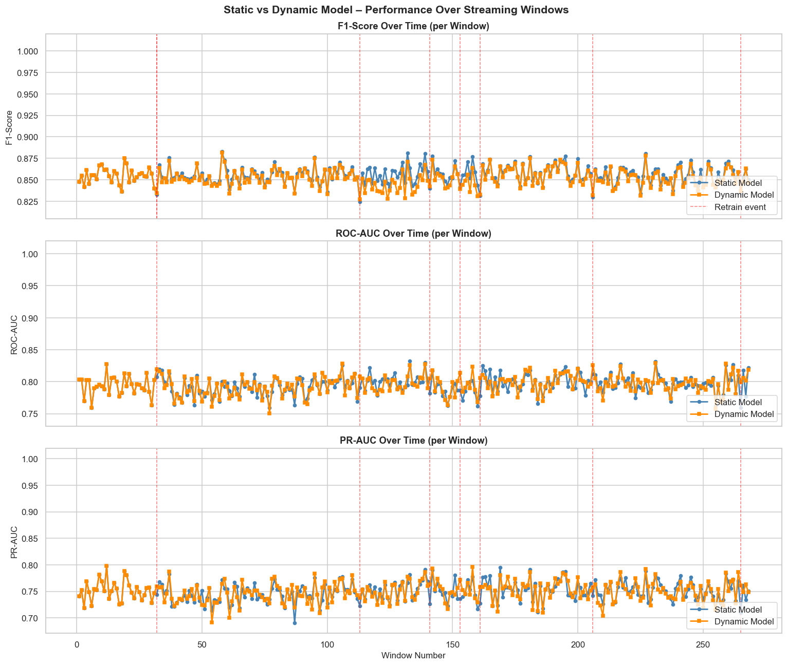

**Performance gap (static vs dynamic)**

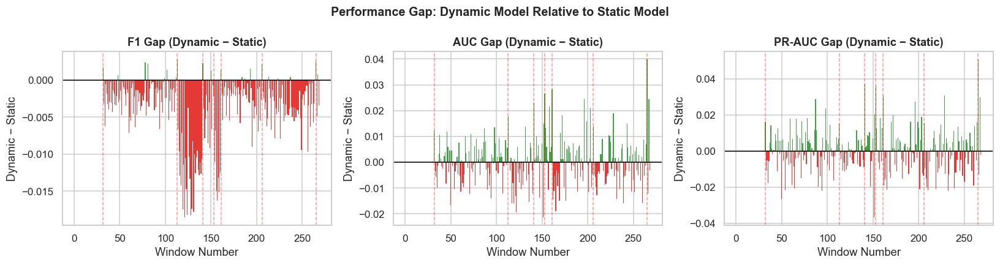

**Retrain decisions**

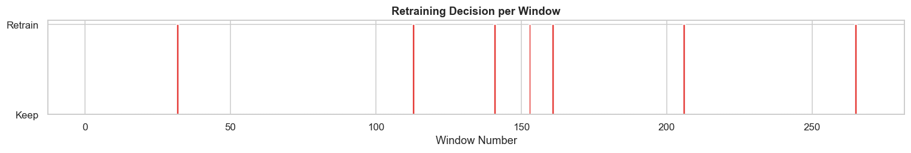

**Final confusion matrix (streaming evaluation)**

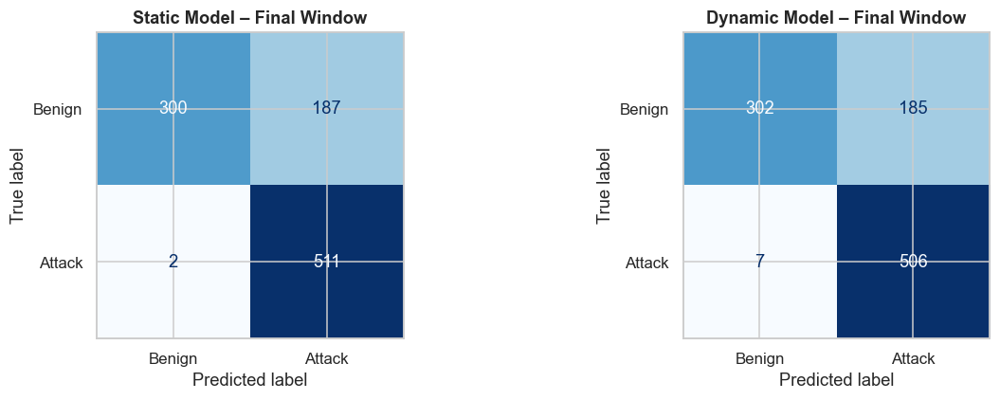

---

## Repository Structure

```
dns-exfiltration/
├── README.md
├── AshpreetKaur_300411645_Assignment2_Report copy.docx   # Full report (evaluation matrices & analysis)
├── setup_docs/
│   ├── Static_model copy.ipynb      # Part I: static classification & evaluation
│   ├── Dynamic_model copy.ipynb    # Part II: online learning with Kafka
│   ├── dns_kafka_producer.ipynb    # Push CSV data to Kafka topic
│   ├── dns_kafka_consumer.ipynb    # Simple Kafka consumer
│   ├── docker-compose.yml          # Zookeeper + Kafka
│   ├── docker_script.sh            # Start Docker and create topics (Unix)
│   ├── docker_script.bat           # Start Docker and create topics (Windows)
│   ├── requirements.txt           # Python dependencies
│   ├── Static_dataset.csv          # Batch dataset for static model
│   ├── Kafka_dataset.csv          # Streaming dataset for producer
│   ├── fig_01_class_distribution.png … fig_15_final_confusion.png   # Generated figures
│   ├── best_static_model.pkl       # Trained static model (from Part I)
│   ├── scaler.pkl                  # Fitted scaler
│   └── selected_features.pkl      # Selected feature list
```

---

## Setup

### 1. Python environment

```bash
cd setup_docs
pip install -r requirements.txt
```

Dependencies include `pandas`, `kafka-python`, `kafka`, `tqdm`, and the usual ML stack (`scikit-learn`, `matplotlib`, `seaborn`, `joblib` — install as needed).

### 2. Kafka (Docker)

From `setup_docs/`:

**Linux/macOS:** `./docker_script.sh`  
**Windows:** `docker_script.bat`

This starts Zookeeper and Kafka and creates topics `ml-raw-dns` and `ml-dns-predictions`.

### 3. Run order

1. Start Kafka (Docker scripts above).  
2. **Part I:** Run `Static_model copy.ipynb` to train and evaluate; it saves `best_static_model.pkl`, `scaler.pkl`, `selected_features.pkl`.  
3. **Part II:** Run `Dynamic_model copy.ipynb` (loads those artefacts and consumes from Kafka).  
4. To feed stream data: run `dns_kafka_producer.ipynb` to push `Kafka_dataset.csv` into the topic; the dynamic notebook or `dns_kafka_consumer.ipynb` can then consume it.

---

## Datasets

- **Static_dataset.csv** — Batch DNS data for Part I (training and test).  
- **Kafka_dataset.csv** — Data replayed into Kafka for Part II streaming.  

Feature descriptions and target encoding are in the notebooks and in the report.

---

## Report

Detailed evaluation matrices and analysis:

- **Notebooks:** `setup_docs/Static_model copy.ipynb` (Part I) and `setup_docs/Dynamic_model copy.ipynb` (Part II).  
- **Written report:** `AshpreetKaur_300411645_Assignment2_Report copy.docx`.

---

## License

Use according to your institutional and course policies.
